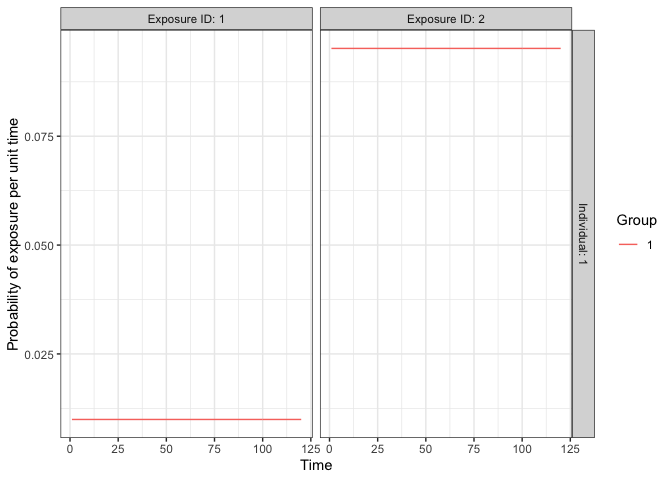
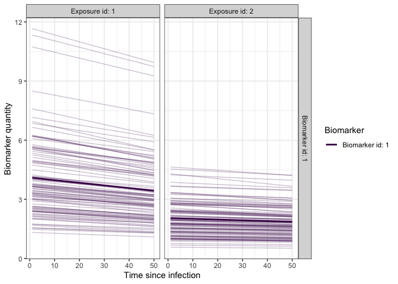
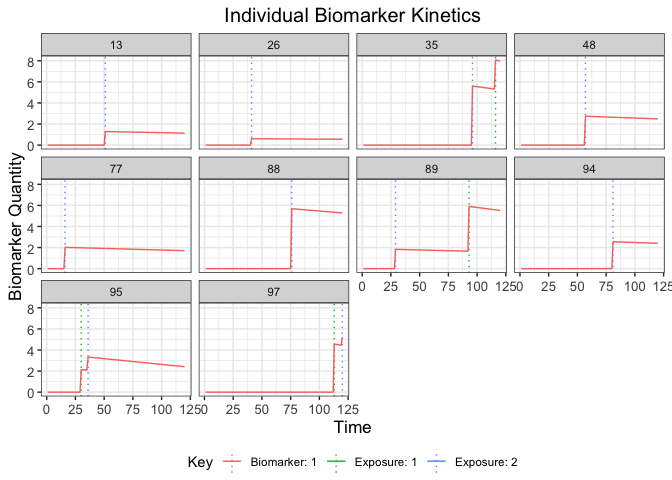
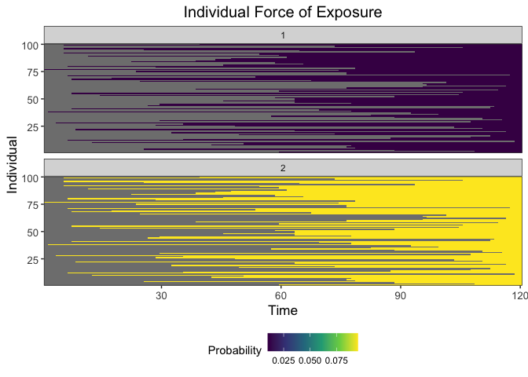
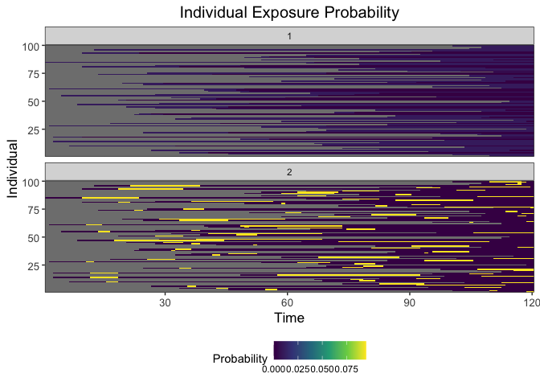
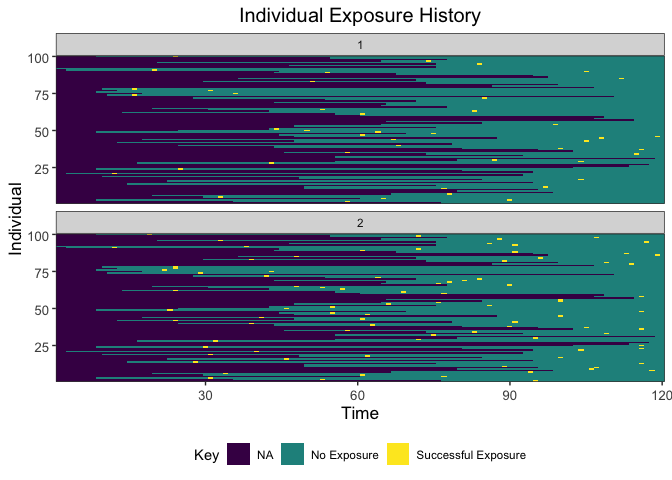
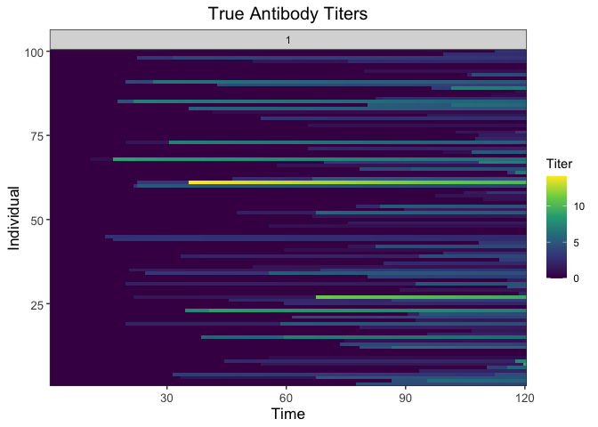
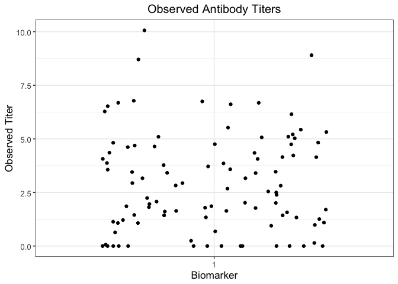

README
================

# Motivation

The *serosim* package is designed to simulate serological survey data
arising from user-specified vaccine or infection-generated and antibody
kinetics processes. *serosim* allows users to specify and adjust model
inputs responsible for generating the observed biomarker quantities like
time-varying patterns of infection and vaccination, population
demography, immunity and antibody kinetics, and serological survey
sampling design in order to best represent the population and disease
system(s) of interest.

Here, we will use the *serosim* package to generate a simple
cross-sectional serosurvey at the end of a 10 year simulation period for
100 individuals who have either been vaccinated, infected, both or
neither. We will set up each of the required arguments and models for
the *runserosim* function in the order outlined in the methods section
of the paper. We then run the simulation and examine its outputs

# Installation

Load necessary packages:

``` r
## Install and load serosim 
devtools::load_all("~/Documents/GitHub/serosim")

## Load additional packages required 
library(tidyverse)
library(data.table)
library(ggplot2)
library(patchwork)
library(reshape2)
```

# 1.1 Simulation Settings

We will simulate monthly time steps across a 10 year period. Therefore,
we will have 120 time steps. Note that these are arbitrary time steps
which will need to be scaled to the right time resolution to match any
time-based parameters used later on.

``` r
## Specify the number of time steps in the simulation
times <- seq(1,120,by=1) 

## Set simulation settings argument needed for runserosim 
simulation_settings <- list("t_start"=1,"t_end"=max(times))
```

# 1.2 Population Demography

For this case study, we will be simulating a population with 100
individuals and we are not interested in tracking any demography
information other than an individual’s birth time. We will use the
generate_pop_demography function to create the demography tibble needed
for *runserosim*.

Note: The *runserosim* function only requires a demography tibble with
two columns (individuals and times). In this case it will assume all
individuals are born at the start of the simulation period.

``` r
## Generate the population demography tibble
## Specify the number of individuals in the simulation; N=100
## No individuals are removed from the population; prob_removal=0
demography <- generate_pop_demography(N=100, times=times, prob_removal=0)
```

    ## Joining, by = "i"

``` r
## Examine the generated demography tibble
summary(demography)
```

    ##        i              birth           removal        times       
    ##  Min.   :  1.00   Min.   :  1.00   Min.   :121   Min.   :  1.00  
    ##  1st Qu.: 25.75   1st Qu.: 26.00   1st Qu.:121   1st Qu.: 30.75  
    ##  Median : 50.50   Median : 61.50   Median :121   Median : 60.50  
    ##  Mean   : 50.50   Mean   : 60.71   Mean   :121   Mean   : 60.50  
    ##  3rd Qu.: 75.25   3rd Qu.: 91.25   3rd Qu.:121   3rd Qu.: 90.25  
    ##  Max.   :100.00   Max.   :116.00   Max.   :121   Max.   :120.00

# 1.3 Exposure to biomarker mapping

Now we set up the exposure IDs and biomarker IDs for the simulation
which will determine which infection or vaccination events are
occurring. Here, we will simulate one circulating pathogen
(exposure_ID=ifxn) and one vaccine (exposure_ID=vacc) both of which will
boost the same biomarker, IgG titers (biomarker_ID=IgG). This biomarker
map can be used for any simulations of vaccine preventable diseases like
measles vaccination and measles natural infection. *runserosim* requires
that exposure_id and biomarker_id are numeric so we will use the
reformat_biomarker_map function to create a new version of the biomarker
map. Users can go directly to numeric biomarker_map if they wish.

Note that the reformat_biomarker_map function will number the exposures
and biomarkers in alphabetical order so that the first exposure event or
biomarker that is listed will not necessarily be labeled as 1.

``` r
## Create biomarker map
biomarker_map_original <- tibble(exposure_id=c("ifxn","vacc"),biomarker_id=c("IgG","IgG"))
biomarker_map_original
```

    ## # A tibble: 2 × 2
    ##   exposure_id biomarker_id
    ##   <chr>       <chr>       
    ## 1 ifxn        IgG         
    ## 2 vacc        IgG

``` r
## Reformat biomarker_map for runserosim
biomarker_map <-reformat_biomarker_map(biomarker_map_original)
biomarker_map
```

    ## # A tibble: 2 × 2
    ##   exposure_id biomarker_id
    ##         <dbl>        <dbl>
    ## 1           1            1
    ## 2           2            1

# 1.4 Force of Exposure and Exposure Model

Now, we need to specify the foe_pars argument which contains the force
of exposure for all exposure_IDs across all time steps. We also specify
the exposure model which will be called within *runserosim* later. The
exposure model will determine the probability that an individual is
exposed to a specific exposure event. Since we did not specify different
groups within demography, all individuals will automatically be assigned
group 1. Therefore, we only need 1 row for dimension 1 in foe_pars.
Groups can be used as an indicator of location if the user wishes to
specify a location specific force of exposure. Dimension 3 of the
foe_array must be in the same order as the exposure_id within the
biomarker map. For example, the force of exposure for exposure_id 1 will
be inputted within the foe_pars\[,,1\]. We specified the same force of
exposure for all time steps within foe_pars for simplicity but users
will likely have varying numbers to match real world settings.

``` r
## Create an empty array to store the force of exposure for all exposure types
foe_pars <- array(0, dim=c(1,max(times),n_distinct(biomarker_map$exposure_id)))
## Specify the force of exposure for exposure ID 1 which represents natural infection
foe_pars[,,1] <- 0.01
## Specify the force of exposure for exposure ID 2 which represents vaccination
foe_pars[,,2] <- 0.1

## Specify a simple exposure model which calculates the probability of exposure directly from the force of exposure at that time step. In this selected model, the probability of exposure is 1-exp(-FOE) where FOE is the force of exposure at that time.
exposure_model<-exposure_model_simple_FOE

## Examine the probability of exposure over time for the specified exposure model and foe_pars array
plot_exposure_model(exposure_model=exposure_model_simple_FOE, times=times, n_groups = 1, n_exposures = 2, foe_pars=foe_pars)
```

<!-- -->

# 1.5 Immunity Model

Here, we specify the immunity model which will determine the probability
that an exposure event is successful in producing an immunological
response. We will use a simple immunity model
(immunity_model_vacc_ifxn_simple) where successful exposure is only
conditional on the total number of previous exposure events. With this
model, the probability of successful vaccination exposure depends on the
number of vaccines received prior to time t and the individual’s age at
time t while the probability of successful infection is dependent on the
number of infections prior to time t.

``` r
## Specify immunity model within runserosim function below 
immunity_model<-immunity_model_vacc_ifxn_simple

## Create 3 additional arguments needed for this immunity model 
## Specify which exposure IDs represent vaccination events 
vacc_exposures<-2
## Specify the age at which an individual is eligible for vaccination (9 months old); note non vaccine exposures are listed as NAs
vacc_age<-c(NA,9)
## Specify the maximum number of successful events an individual can receive for each exposure type (1 infection event and 1 vaccination event)
max_events<-c(1,1)
```

# 1.6 Antibody Model and Model Parameters

Now, we specify the antibody model to be used within *runserosim* to
track antibody kinetics, or more broadly biomarker kinetics for each
biomarker produced from successful exposure events. We will be using a
monophasic boosting-waning model in this example. This model assumes
that for each exposure there is a boost and boost waning parameter. The
antibody kinetics parameters are pre-loaded within a csv file. Users can
edit the csv file to specify their own parameters. All parameters needed
for the user specified antibody model must be specified within the
model_pars. Lastly, we define the draw_parameters function which
determines how each individual’s antibody kinetics parameters are
simulated from the within-host processes parameters tibble (model_pars).
We will use a function which draws parameters directly from model_pars
for the antibody model with random effects to represent individual
heterogeneity in immunological responses. Parameters are drawn randomly
from a distribution with mean and standard deviation specified within
model_pars. *runserosim* requires that exposure_id and biomarker_id
within model_pars are numeric and match the exposure to biomarker map so
we will use the reformat_biomarker_map function again to create a new
version of model_pars. Users can go directly to numeric model_pars if
they wish.

``` r
## Specify the antibody model 
antibody_model<-antibody_model_monophasic

## Bring in the antibody parameters needed for the antibody model
## Note that the observation error parameter needed for the observation model (Section 1.7) is defined here too.
model_pars_path <- system.file("extdata", "model_pars_README.csv", package = "serosim")
model_pars_original <- read.csv(file = model_pars_path, header = TRUE)
model_pars_original 
```

    ##   exposure_id biomarker_id   name   mean     sd distribution
    ## 1        ifxn          IgG  boost 4.0000 2.0000   log-normal
    ## 2        ifxn          IgG   wane 0.0033 0.0005   log-normal
    ## 3        <NA>          IgG obs_sd     NA 0.2500       normal
    ## 4        vacc          IgG  boost 2.0000 1.0000   log-normal
    ## 5        vacc          IgG   wane 0.0016 0.0005   log-normal

``` r
## Reformat model_pars for runserosim
model_pars<-reformat_biomarker_map(model_pars_original)
model_pars
```

    ##   exposure_id biomarker_id   name   mean     sd distribution
    ## 1           1            1  boost 4.0000 2.0000   log-normal
    ## 2           1            1   wane 0.0033 0.0005   log-normal
    ## 3          NA            1 obs_sd     NA 0.2500       normal
    ## 4           2            1  boost 2.0000 1.0000   log-normal
    ## 5           2            1   wane 0.0016 0.0005   log-normal

``` r
## Specify the draw_parameters function
draw_parameters<-draw_parameters_random_fx

## Plot example biomarker trajectories given the specified antibody kinetics model, model parameters and draw parameters function 
plot_antibody_model(antibody_model_monophasic, N=100, model_pars=model_pars,draw_parameters_fn = draw_parameters_random_fx, biomarker_map=biomarker_map)
```

<!-- -->

# 1.7 Observation Model and observation_times

Now we specify how observed biomarker quantities are generated as a
probabilistic function of the true, latent biomarker quantity and when
to observe these quantities. In this step, we specify the sampling
design and assay choice for our serological survey. We will take samples
of all individuals at the end of the simulation (t=120).

Our chosen observation model observes the latent biomarker quantity
given a continuous assay with added noise. The added noise represents
assay variability and is implemented by sampling from a distribution
with the true latent biomarker quantity as the mean and the measurement
error as the standard deviation. The observation standard deviation and
distribution are defined within model_pars as the “obs_sd” parameter.
Within this observation model, we can also specify the assay sensitivity
and specificity.

``` r
## Specify the observation model 
observation_model<-observation_model_continuous_noise

## Specify assay sensitivity and specificity needed for the observation model
sensitivity<-0.85
specificity<-0.9

## Specify observation_times (serological survey sampling design) to observe biomarker 1 across all individuals at the end of the simulation (t=120)
observation_times<- tibble(i=1:max(demography$i),t=120, b=1)
```

# 1.8 Optional Arguments

There are no optional arguments needed for this simulation.

# 1.9 Run Simulation

This is the core simulation where all simulation settings, models and
parameters are specified within the main simulation function. Run time
for this step varies depending on the number of individuals and the
complexities of the specified models. There is a built in
pre-computation step within *runserosim* where the simulation attempts
to perform as much pre-computation as possible for the exposure model to
speed up the main simulation code. Users can turn off this
pre-computation by setting pre-computation to FALSE within *runserosim*.

``` r
## Run the core simulation and save outputs in "res"
res<- runserosim(
  simulation_settings,
  demography,
  observation_times,
  foe_pars,
  biomarker_map,
  model_pars,
  exposure_model,
  immunity_model,
  antibody_model,
  observation_model,
  draw_parameters,

  ## Other arguments needed
  max_events=max_events,
  vacc_exposures=vacc_exposures,
  vacc_age=vacc_age,
  sensitivity=sensitivity,
  specificity=specificity
)

## Note that models and arguments specified earlier in the code can be specified directly within this function.
```

# 1.10 Generate Plots

Now that the simulation is complete, let’s plot and examine the
simulation outputs.

``` r
## Plot biomarker kinetics and exposure histories for 10 individuals 
plot_subset_individuals_history(res$biomarker_states, res$exposure_histories_long, subset=10, demography)
```

<!-- -->

``` r
## Plot individual force of exposure for all exposure types
## This is the output of the exposure model.
## Note: All individuals are under the same force of exposure since we specified a simple exposure model and constant foe_pars
plot_exposure_force(res$exposure_force_long)
```

<!-- -->

``` r
## Plot individual successful exposure probabilities for all exposure types
## This is the output of the exposure model multiplied by the output of the immunity model.
## In other words, this is the probability of an exposure event being successful and inducing an immunological response
plot_exposure_prob(res$exposure_probabilities_long)
```

<!-- -->

``` r
## Plot individual exposure histories for all exposure types
plot_exposure_histories(res$exposure_histories_long)
```

<!-- -->

``` r
## Plot true biomarker quantities for all individuals across the entire simulation period
plot_biomarker_quantity(res$biomarker_states)
```

<!-- -->

``` r
## Plot the serosurvey results (observed biomarker quantities)
plot_obs_biomarkers_one_sample(res$observed_biomarker_states)
```

<!-- -->

``` r
## Note that the simulated kinetics parameters are also stored
head(res$kinetics_parameters)
```

    ## # A tibble: 6 × 7
    ##       i     t     x     b name    value realized_value
    ##   <int> <dbl> <dbl> <dbl> <chr>   <dbl>          <dbl>
    ## 1     1    74     2     1 boost 0.979          0.979  
    ## 2     1    74     2     1 wane  0.00188        0.00188
    ## 3     3    18     2     1 boost 3.97           3.97   
    ## 4     3    18     2     1 wane  0.00109        0.00109
    ## 5     3    53     1     1 boost 2.70           2.70   
    ## 6     3    53     1     1 wane  0.00387        0.00387

``` r
## Plots for the paper 
# library(cowplot)
# plot_grid(plot_exposure_prob(res$exposure_probabilities_long), plot_exposure_histories(res$exposure_histories_long), nrow=1, ncol=2, align = "hv", scale=c(.98,.98))
# plot_grid(plot_biomarker_quantity(res$biomarker_states), plot_obs_biomarkers_one_sample(res$observed_biomarker_states), nrow=1, ncol=2, align = "hv", scale=c(.98,.98))
```
